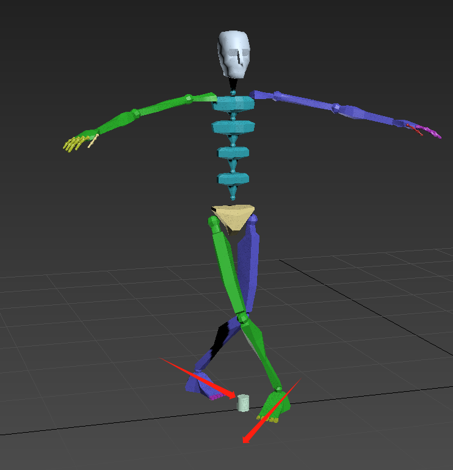
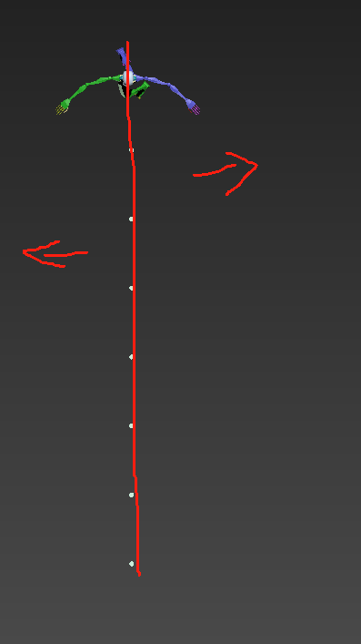
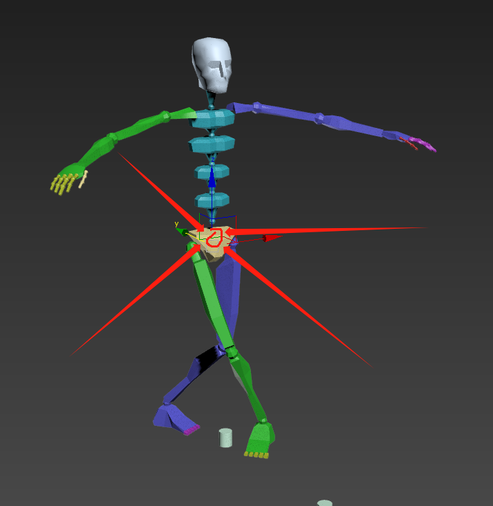
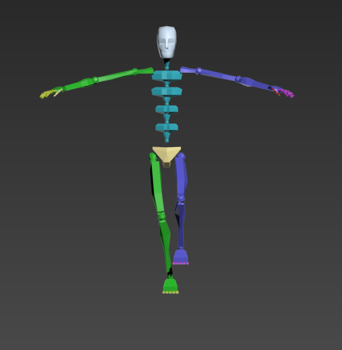
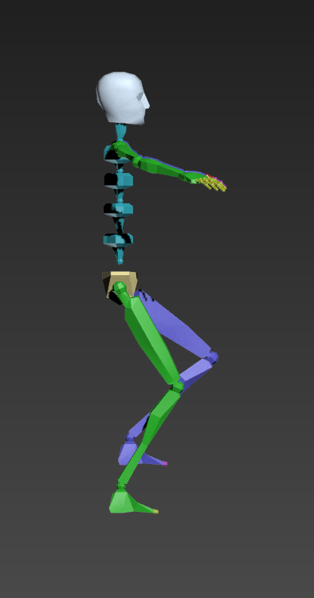
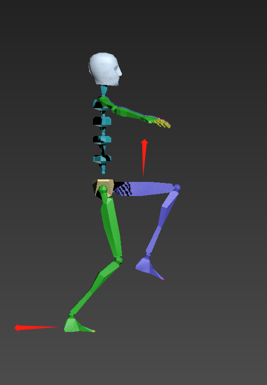
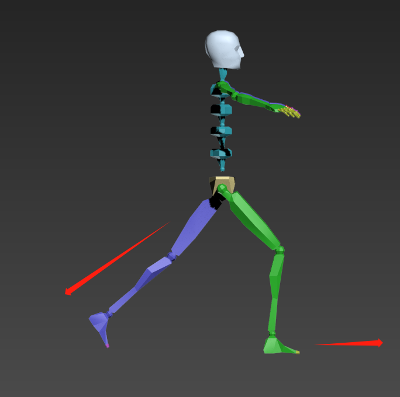
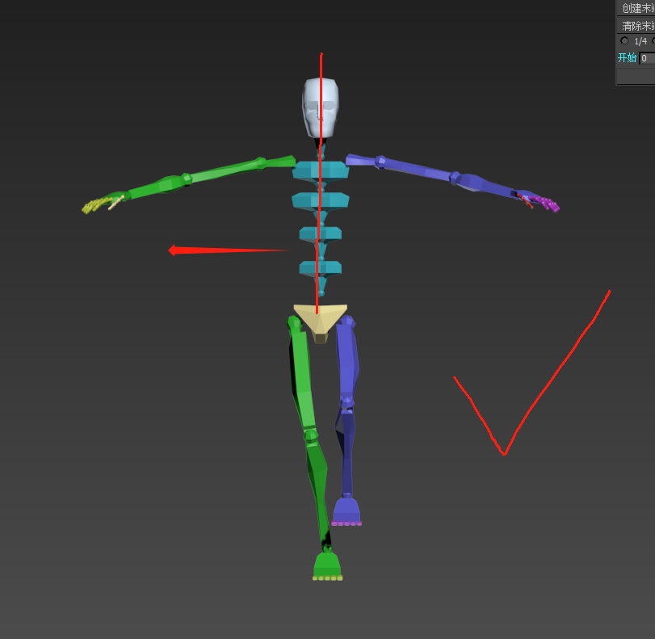
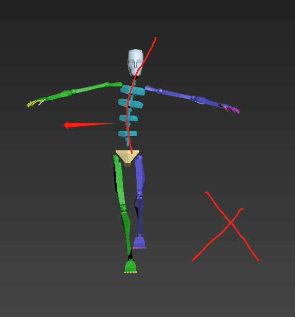
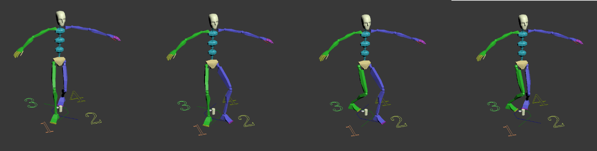

# 基础入门

## 正交叉

正交叉重心在两脚中间，脚要保持一前一后，重心没有明显上下起伏，通过外八、内八、交叉向前移动

这个时候就需要脚主动改变方向之后在发力向两侧滑行

向前移动的时候重心需要一直保持在桩线上面，不可离开桩线

这里是重心

## 单脚支撑

绿腿为支撑腿，蓝腿为浮腿。

单脚滑行时，浮腿要高于CUFF。

单脚支撑的时候，用大腿往上带，支撑腿往后滑。

## Crazy

